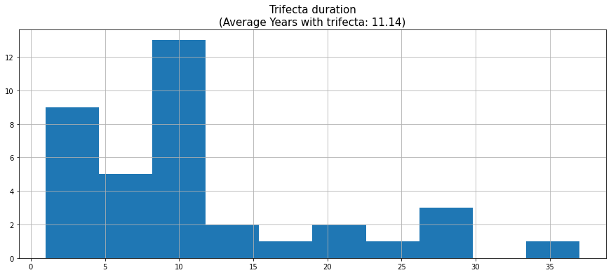
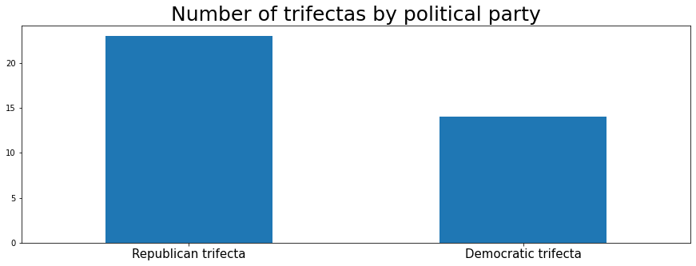
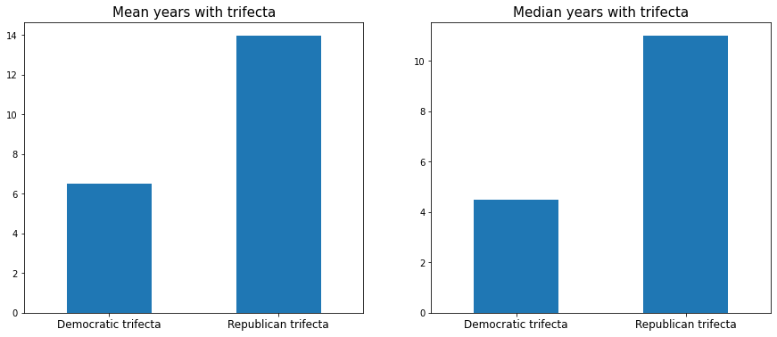

# Analyzing State Supermajorities


The data for this analysis comes from [Ballotpedia](https://ballotpedia.org/) and contains data that classifies states according to the degree of "monopoly" a political party has over the state's government. 

I encourage you to check out the analysis [here](https://ballotpedia.org/State_government_trifectas) which is where the data is source from. 

Ballotpedia classifies states in different types of **Trifectas**. Below is Ballotpedia's definition for `Trifectas`:

> State government trifecta is a term to describe single-party government, 
when one political party holds the governorship and majorities 
in both chambers of the state legislature. 


**Below I collect the dataset from Ballotpedia's website**


```python
import pandas as pd
from datetime import datetime
import matplotlib.pyplot as plt
from IPython.display import display

df = pd.read_html('https://ballotpedia.org/State_government_trifectas')[4]
df.head()
```


<div>
<style scoped>
    .dataframe tbody tr th:only-of-type {
        vertical-align: middle;
    }

    .dataframe tbody tr th {
        vertical-align: top;
    }

    .dataframe thead tr th {
        text-align: left;
    }
</style>
<table border="1" class="dataframe">
  <thead>
    <tr>
      <th></th>
      <th colspan="4" halign="left">Trifecta status by state</th>
    </tr>
    <tr>
      <th></th>
      <th>State</th>
      <th>Trifecta status</th>
      <th>Year of last status change</th>
      <th>Unnamed: 3_level_1</th>
    </tr>
  </thead>
  <tbody>
    <tr>
      <th>0</th>
      <td>Alabama</td>
      <td>Republican trifecta</td>
      <td>2011</td>
      <td>NaN</td>
    </tr>
    <tr>
      <th>1</th>
      <td>Alaska</td>
      <td>Divided government</td>
      <td>2015</td>
      <td>NaN</td>
    </tr>
    <tr>
      <th>2</th>
      <td>Arizona</td>
      <td>Republican trifecta</td>
      <td>2009</td>
      <td>NaN</td>
    </tr>
    <tr>
      <th>3</th>
      <td>Arkansas</td>
      <td>Republican trifecta</td>
      <td>2015</td>
      <td>NaN</td>
    </tr>
    <tr>
      <th>4</th>
      <td>California</td>
      <td>Democratic trifecta</td>
      <td>2011</td>
      <td>NaN</td>
    </tr>
  </tbody>
</table>
</div>


**Next I...**
- Drop unecessary columns
- Add a column that counts the number years since the status of the state's trifecta has changed


```python
df.columns = df.columns.droplevel().str.lower().str.replace(' ', '_')
df = df[[x for x in df.columns if 'unnamed' not in x]]
df = df.assign(years_with_trifecta=datetime.now().year - df.year_of_last_status_change.astype(int))
display(df.head())
```


<div>
<style scoped>
    .dataframe tbody tr th:only-of-type {
        vertical-align: middle;
    }

    .dataframe tbody tr th {
        vertical-align: top;
    }

    .dataframe thead th {
        text-align: right;
    }
</style>
<table border="1" class="dataframe">
  <thead>
    <tr style="text-align: right;">
      <th></th>
      <th>state</th>
      <th>trifecta_status</th>
      <th>year_of_last_status_change</th>
      <th>years_with_trifecta</th>
    </tr>
  </thead>
  <tbody>
    <tr>
      <th>0</th>
      <td>Alabama</td>
      <td>Republican trifecta</td>
      <td>2011</td>
      <td>11</td>
    </tr>
    <tr>
      <th>1</th>
      <td>Alaska</td>
      <td>Divided government</td>
      <td>2015</td>
      <td>7</td>
    </tr>
    <tr>
      <th>2</th>
      <td>Arizona</td>
      <td>Republican trifecta</td>
      <td>2009</td>
      <td>13</td>
    </tr>
    <tr>
      <th>3</th>
      <td>Arkansas</td>
      <td>Republican trifecta</td>
      <td>2015</td>
      <td>7</td>
    </tr>
    <tr>
      <th>4</th>
      <td>California</td>
      <td>Democratic trifecta</td>
      <td>2011</td>
      <td>11</td>
    </tr>
  </tbody>
</table>
</div>


**Next I filter out states with a "Diveded government" status because they different bodies of the state government are controlled by different political parties**


```python
df = df.query('~trifecta_status.str.contains("Divided")')
```

### How many states have a current trifecta?


```python
print('States with trifecta:', df.shape[0])
```

    States with trifecta: 37


### How long on average have states held their current trifectas?


```python
average_years_trifecta = round(df.years_with_trifecta.mean(), 2)
df.years_with_trifecta.hist(figsize=(15,6))
plt.title(f'Trifecta duration\n(Average Years with trifecta: {average_years_trifecta})', fontsize=15);
```


    

    


### How many trifecta does each party have?


```python
df.trifecta_status.value_counts().plot(kind='bar', figsize=(15,5))
plt.xticks(rotation=0, fontsize=15)
plt.title('Number of trifectas by political party', fontsize=25);
```


    

    


### What is the average amount of years each party has held their trifecta?


```python
fig, ax = plt.subplots(1,2, figsize=(15,6))

df.groupby('trifecta_status').years_with_trifecta.mean().plot(kind='bar', ax=ax[0])
for label in ax[0].get_xticklabels():
    label.set_rotation(0)
    label.set_fontsize(12)
    
df.groupby('trifecta_status').years_with_trifecta.median().plot(kind='bar', ax=ax[1])
for label in ax[1].get_xticklabels():
    label.set_rotation(0)
    label.set_fontsize(12)

ax[0].set_xlabel('')
ax[1].set_xlabel('')
ax[0].set_title('Mean years with trifecta', fontsize=15)
ax[1].set_title('Median years with trifecta', fontsize=15);
```


    

    

